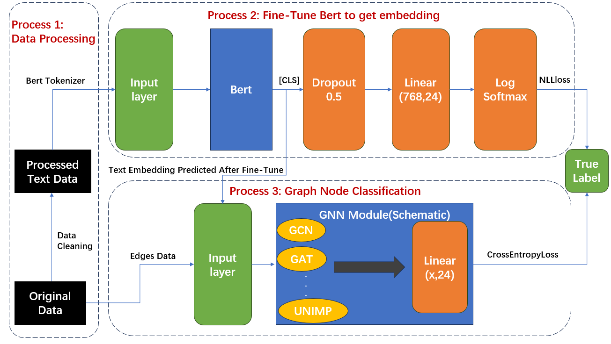

# CCF-BDCI-2023

The URL of competition:https://www.datafountain.cn/competitions/982/

Also you can get the data from the URL

We can't ensure you can successfully run all the code in only environment

### Data prepared:

Process 1: Get it from URL

Process 2: Get it from Process1 and URL

Process 3: Get it from Process2

### Environment prepared:

Process 1 and 2: Just try the latest version

Process 3：You may meet with some questions,here're some advice

~~~bash
pip install paddlepaddle-gpu==1.8.4.post107
pip install pgl==1.2.0 easydict
~~~

If you get error with protoc,try this

~~~bash
conda install protobuf 
~~~

We use Tesla V100 32G with cuda version 9.0 to run this part 

Anyway,if you have any question,Please contact me

**Our model structure is shown below:**

